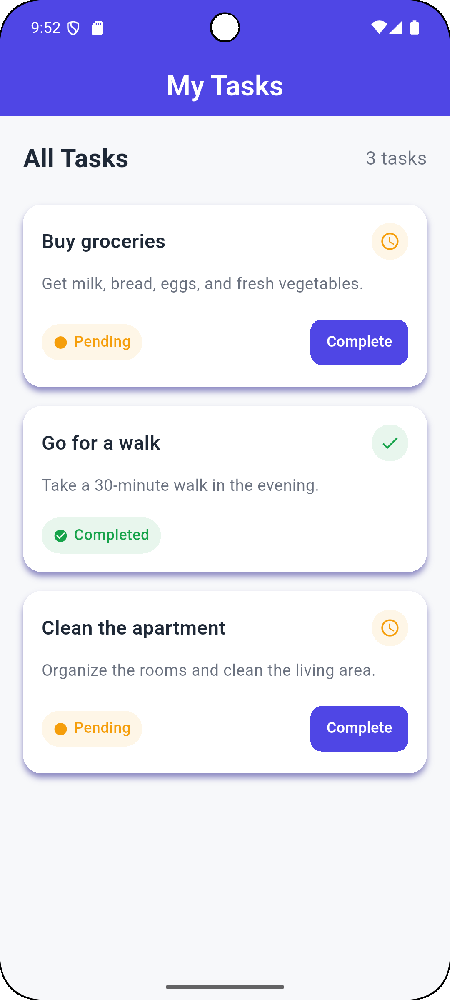

# Task Management App

A simple and clean Task Management App built with Flutter.

This project was developed as a Flutter UI challenge with a focus on clean UI, responsive layout, reusable widgets, and proper project structure.

## Features

- Show task title and description.
- Display task completion status.
- Mark pending tasks as completed.
- Responsive layout for different screen sizes.
- Clean and organized Flutter project structure.
- Reusable widgets for better code organization.

## Screenshots



## Project Structure

```text
lib/
├── core/
│   └── theme/
│       ├── app_colors.dart
│       └── app_text_styles.dart
│
├── data/
│   ├── models/
│   │   └── task_model.dart
│   └── tasks_data.dart
│
└── features/
    └── tasks/
        ├── screens/
        │   └── home_screen.dart
        │
        └── widgets/
            ├── home_header.dart
            ├── tasks_list.dart
            └── task_card.dart